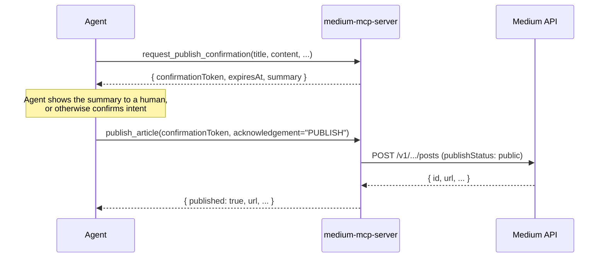

# medium-mcp-server

A production-ready, remote [Model Context Protocol](https://modelcontextprotocol.io) server for a single
Medium account. It gives an MCP client (Claude, or any other MCP-compatible agent) authenticated access
to:

- **Profile & publication retrieval** — who you're authenticated as, and which publications you belong to.
- **Article retrieval** — recent articles and full article content, read-only.
- **Article drafting** — create private drafts on Medium.
- **Article publishing** — make an article public (or unlisted), gated behind an explicit, two-step
  confirmation flow so nothing goes live from a single tool call.

Read access, write access (drafting), and publish access are three independently toggleable capabilities,
so you can deploy a read-only instance, a read+draft instance, or the full read/write/publish instance,
depending on how much you trust the client calling it.

## Table of contents

- [How this maps to Medium's actual API](#how-this-maps-to-mediums-actual-api)
- [Tools](#tools)
- [The publish confirmation flow](#the-publish-confirmation-flow)
- [Architecture](#architecture)
- [Configuration](#configuration)
- [Running locally](#running-locally)
- [Connecting a client](#connecting-a-client)
- [Testing](#testing)
- [Deployment](#deployment)
- [Security notes](#security-notes)
- [Logging & observability](#logging--observability)
- [Troubleshooting](#troubleshooting)

## How this maps to Medium's actual API

Medium's [official REST API](https://github.com/Medium/medium-api-docs) is intentionally small, and this
server is honest about its limits rather than papering over them with scraping hacks:

| Capability | Medium API reality | How this server does it |
| --- | --- | --- |
| Auth | Self-issued **integration token**, sent as a Bearer token. Medium closed public OAuth app registration; integration tokens are the supported path for personal/self-hosted use today. | `MEDIUM_INTEGRATION_TOKEN`, used by every Medium API call. |
| Get my profile | `GET /v1/me` | `get_profile` |
| List my publications | `GET /v1/users/{id}/publications` | `list_publications` |
| **List/get existing posts** | **Not exposed at all.** Medium's API has no endpoint to list or fetch a user's or publication's existing posts, published or draft. | `list_articles` / `get_article` read Medium's public **RSS feed** (`medium.com/feed/@user` or `medium.com/feed/<publication-slug>`) instead, which Medium includes full post HTML in. This only ever surfaces already-**public** posts — drafts and unlisted posts never appear in RSS, and there is no API workaround for that. |
| Create a draft | `POST /v1/users/{id}/posts` or `POST /v1/publications/{id}/posts` with `publishStatus: "draft"` | `create_draft` |
| Publish | Same create-post endpoint with `publishStatus: "public"` (or `"unlisted"`) | `request_publish_confirmation` + `publish_article` |
| **Edit/update a post** | **Not exposed at all.** Once created via the API, a post cannot be edited or transitioned (e.g. draft → public) through the API. | Not implemented — there is nothing to call. `create_draft` and `publish_article` each independently create a **new** post; publishing does not "promote" a draft created earlier. If you need to edit before it's live, finish the draft on medium.com, then use `request_publish_confirmation` + `publish_article` with the final content. |
| **Unpublish/delete** | **Not exposed at all.** | Not implemented. Treat every `publish_article` call as final. |

If a future capability you need isn't listed above, it's very likely because Medium's API doesn't support
it — check the [official API docs](https://github.com/Medium/medium-api-docs) before assuming this server
is missing something.

## Tools

| Tool | Category | Requires | Description |
| --- | --- | --- | --- |
| `get_profile` | read | `MEDIUM_ENABLE_READ_TOOLS` | Authenticated user's profile (id, username, name, URL, avatar). |
| `list_publications` | read | `MEDIUM_ENABLE_READ_TOOLS` | Publications a user (default: you) contributes to. |
| `list_articles` | read | `MEDIUM_ENABLE_READ_TOOLS` | Recent public articles for a user or publication, via RSS. |
| `get_article` | read | `MEDIUM_ENABLE_READ_TOOLS` | Full HTML content + metadata of one public article, via RSS. |
| `create_draft` | write | `MEDIUM_ENABLE_WRITE_TOOLS` | Creates a private draft post on Medium. |
| `request_publish_confirmation` | publish (step 1/2) | `MEDIUM_ENABLE_PUBLISH_TOOL` | Validates an article, resolves its target, and returns a short-lived confirmation token + human-readable summary. **Makes no change to Medium.** |
| `publish_article` | publish (step 2/2) | `MEDIUM_ENABLE_PUBLISH_TOOL` | Redeems a `request_publish_confirmation` token to actually publish. The only tool that makes anything public. |

Read tools carry the MCP `readOnlyHint: true` annotation; `publish_article` carries `destructiveHint: true`.
Well-behaved MCP clients can use these to decide what needs a human in the loop, in addition to this
server's own enforcement below.

## The publish confirmation flow

Publishing is deliberately split into two tool calls so an agent (or a human approving its actions) always
sees exactly what is about to go live before it does:



Enforcement, not just prompting:

- `publish_article` **cannot succeed without a prior `request_publish_confirmation` call** — there is no
  path to publish in one step, regardless of what the calling agent is told to do.
- The confirmation token is **single-use** and **expires** after `MEDIUM_PUBLISH_CONFIRMATION_TTL_MS`
  (default 10 minutes) — it can't be replayed or reused for a stale draft.
- `publish_article` also requires a literal `acknowledgement: "PUBLISH"` field, so a client can't wire the
  two calls together blindly without an explicit "yes, really" step in its own call shape.
- Set `MEDIUM_ENABLE_PUBLISH_TOOL=false` to remove publishing capability from a deployment entirely (both
  tools disappear from `tools/list`), while still allowing reads and drafts.

See [`src/confirmationStore.ts`](src/confirmationStore.ts) for the implementation; see
["Scaling the confirmation store"](#scaling-the-confirmation-store-multi-replica-deployments) below if you
plan to run more than one replica.

## Architecture

```
src/
  index.ts              Entry point: loads config, wires dependencies, starts stdio or HTTP transport
  config.ts              Environment variable parsing & validation (zod)
  logger.ts               Structured logging (pino), with secret redaction
  errors.ts                Typed error hierarchy (AppError and subclasses)
  mediumClient.ts           Medium REST API client (auth, get profile, list publications, create post)
  rssClient.ts               Medium RSS client (article listing/retrieval)
  confirmationStore.ts        Publish confirmation token store (TTL, single-use)
  server.ts                    Builds an McpServer and registers tool groups per feature flags
  httpApp.ts                    Express app: bearer auth, session-managed Streamable HTTP transport, /healthz
  lib/
    fetchWithRetry.ts            Timeout + bounded exponential-backoff retry wrapper around fetch
    resolvePostInput.ts           Turns validated tool input into a Medium createPost payload
  tools/
    context.ts                    Shared dependency-injection type for tool registrars
    schemas.ts                     Shared zod input schema for article content
    toolHelpers.ts                  JSON result helper + per-tool structured logging wrapper
    read.ts                          get_profile, list_publications, list_articles, get_article
    write.ts                          create_draft
    publish.ts                        request_publish_confirmation, publish_article
```

Design choices worth calling out:

- **Dependency injection over singletons.** `MediumClient` and `RssClient` both accept an injectable
  `fetchImpl`, and every tool registrar takes a `ToolContext` rather than reaching for module-level state.
  This is what makes the test suite exercise real tool-call validation and routing without any network
  mocking library.
- **One `McpServer` instance per HTTP session.** `httpApp.ts` follows the MCP SDK's standard
  session-managed Streamable HTTP pattern: a new server + transport pair is created on `initialize`, keyed
  by the `Mcp-Session-Id` the SDK generates, and torn down when the session closes.
- **Errors carry a stable `code` and are safe to show a caller.** Every domain error thrown by
  `mediumClient.ts`/`rssClient.ts`/tools extends `AppError`; the MCP SDK catches thrown errors from tool
  handlers automatically and turns them into `{ isError: true, content: [...] }` results, so tool code just
  throws descriptive errors and doesn't need its own try/catch boilerplate for that path.

## Configuration

All configuration is via environment variables (validated at startup with zod — the process exits
immediately with a clear message if something required is missing or malformed). Copy
[`.env.example`](.env.example) to `.env` to get started.

| Variable | Default | Description |
| --- | --- | --- |
| `MEDIUM_INTEGRATION_TOKEN` | *(required)* | Your Medium integration token. Generate one at `medium.com/me/settings/security`. |
| `MEDIUM_API_BASE_URL` | `https://api.medium.com/v1` | Medium REST API base URL. |
| `MEDIUM_RSS_BASE_URL` | `https://medium.com` | Base URL for Medium's public RSS feeds. |
| `MEDIUM_REQUEST_TIMEOUT_MS` | `10000` | Per-request timeout for calls to Medium. |
| `MCP_TRANSPORT` | `http` | `http` (remote server) or `stdio` (local process). |
| `MCP_HTTP_HOST` | `0.0.0.0` | HTTP bind address. |
| `MCP_HTTP_PORT` | `3000` | HTTP port. |
| `MCP_SERVER_AUTH_TOKEN` | *(none)* | Bearer token required on every `/mcp` request. **Required** in production over HTTP unless `MCP_ALLOW_UNAUTHENTICATED=true`. |
| `MCP_ALLOW_UNAUTHENTICATED` | `false` | Explicit opt-out of the auth-token requirement. Not recommended. |
| `MCP_CORS_ORIGIN` | *(none)* | Allowed CORS origin for browser-based MCP clients. Leave unset to disable CORS entirely. |
| `MEDIUM_ENABLE_READ_TOOLS` | `true` | Toggle the read tool group. |
| `MEDIUM_ENABLE_WRITE_TOOLS` | `true` | Toggle `create_draft`. |
| `MEDIUM_ENABLE_PUBLISH_TOOL` | `true` | Toggle both publish tools. |
| `MEDIUM_PUBLISH_CONFIRMATION_TTL_MS` | `600000` | How long a confirmation token stays redeemable. |
| `LOG_LEVEL` | `info` | pino log level (`fatal`\|`error`\|`warn`\|`info`\|`debug`\|`trace`\|`silent`). |
| `LOG_PRETTY` | `false` | Human-readable colorized logs instead of JSON (use for local dev only). |
| `NODE_ENV` | `development` | `development`\|`test`\|`production`. |

## Running locally

```bash
cd medium-mcp-server
npm install
cp .env.example .env   # then fill in MEDIUM_INTEGRATION_TOKEN and MCP_SERVER_AUTH_TOKEN

npm run dev             # HTTP transport, auto-reload, on http://localhost:3000/mcp
npm run dev:stdio       # stdio transport, for Claude Desktop's local MCP config or manual debugging
```

Production build:

```bash
npm run build
npm start                # runs dist/index.js
```

## Connecting a client

### Remote HTTP (Claude.ai custom connector, or any Streamable-HTTP MCP client)

Point the client at `https://<your-deployment>/mcp` with header
`Authorization: Bearer <MCP_SERVER_AUTH_TOKEN>`.

### Claude Desktop (local, stdio)

```json
{
  "mcpServers": {
    "medium": {
      "command": "node",
      "args": ["/absolute/path/to/medium-mcp-server/dist/index.js"],
      "env": {
        "MCP_TRANSPORT": "stdio",
        "MEDIUM_INTEGRATION_TOKEN": "your-token-here"
      }
    }
  }
}
```

## Testing

```bash
npm test               # vitest, single run
npm run test:watch     # vitest, watch mode
npm run test:coverage  # with v8 coverage report
npm run typecheck      # tsc --noEmit over src + test
```

The suite (53 tests) covers:

- `fetchWithRetry` — retry/backoff on 429/5xx, no retry on other 4xx, timeout handling, rate-limit
  exhaustion.
- `MediumClient` — request shaping, auth header, 401/403 → `MediumAuthError`, generic 4xx → `MediumApiError`
  with Medium's own message surfaced, `authorId`/`publicationId` mutual-exclusivity.
- `RssClient` — feed URL construction, article listing with `limit`, single-article lookup by URL, 404
  feed handling.
- `ConfirmationStore` — single-use redemption, expiry, payload-mismatch rejection, token uniqueness.
- Tool-level tests that spin up a **real** `McpServer` and `Client` over the SDK's in-memory transport
  (`test/testHarness.ts`), so `tools/list` shape, zod input validation, and end-to-end tool behavior
  (including the full two-step publish flow and every feature-flag combination) are exercised exactly as a
  real MCP client would see them — against fake `MediumClient`/`RssClient` implementations, never real
  network calls.
- `httpApp.ts` — bearer-auth rejection/acceptance and a full MCP session over a real ephemeral HTTP server,
  via `supertest` and the SDK's own `StreamableHTTPClientTransport`.

## Deployment

A multi-stage [`Dockerfile`](Dockerfile) (non-root user, healthcheck, `npm ci --omit=dev`) is the primary
deployment artifact. Sample configs for common targets are under [`deploy/`](deploy/):

- **Docker / docker-compose:** `docker compose up --build` (reads `MEDIUM_INTEGRATION_TOKEN` and
  `MCP_SERVER_AUTH_TOKEN` from your shell environment or a `.env` file next to `docker-compose.yml`).
- **Fly.io:** [`deploy/fly.toml`](deploy/fly.toml) — `fly launch --copy-config --no-deploy`, then
  `fly secrets set MEDIUM_INTEGRATION_TOKEN=... MCP_SERVER_AUTH_TOKEN=...`, then `fly deploy`.
- **Render:** [`deploy/render.yaml`](deploy/render.yaml) — New → Blueprint, point at this repo, set the two
  secret env vars in the dashboard.
- **Bare VM (systemd):** [`deploy/medium-mcp-server.service`](deploy/medium-mcp-server.service) — run
  `npm run build`, ship `dist/` + `node_modules` (production install) to the host, install the unit.

CI ([`.github/workflows/medium-mcp-server-ci.yml`](../.github/workflows/medium-mcp-server-ci.yml)) runs
typecheck, tests with coverage, a production build, and a Docker build on every push/PR touching this
directory, across Node 18/20/22.

### Scaling the confirmation store (multi-replica deployments)

`ConfirmationStore` is an in-memory, single-process `Map`. That's fine for a single container/VM (the
common case for a personal Medium account server). If you run multiple replicas behind a load balancer:

- Prefer **sticky sessions** so a given MCP session (`Mcp-Session-Id`) always reaches the same replica —
  this is generally required anyway for the Streamable HTTP transport's own session/event-stream state, not
  just for confirmations.
- Or replace `ConfirmationStore` with a shared implementation (e.g. Redis with a `SETNX` + TTL per token)
  behind the same `create`/`redeem` interface in [`src/confirmationStore.ts`](src/confirmationStore.ts).

## Security notes

- The Medium integration token is a bearer credential with full access to your Medium account (posting on
  your behalf). It is never logged (see redaction in `logger.ts`) and is only ever sent to
  `MEDIUM_API_BASE_URL` over HTTPS.
- `MCP_SERVER_AUTH_TOKEN` gates this server itself. `config.ts` **refuses to start** with
  `NODE_ENV=production` + `MCP_TRANSPORT=http` and no token configured, unless you explicitly set
  `MCP_ALLOW_UNAUTHENTICATED=true`. Compare tokens are done with `crypto.timingSafeEqual`.
- `GET /healthz` intentionally bypasses auth (for load balancer / container platform health checks) and
  reveals nothing beyond `{status: "ok"}`.
- Publishing requires the two-step flow described above; there is no code path where a single tool call
  makes content public.
- This server is single-tenant by design (one Medium account per deployment via one integration token).
  Don't expose it to multiple untrusted users expecting per-user Medium accounts — everyone who can reach
  it with the bearer token can post as you.

## Logging & observability

Structured JSON logs via [pino](https://getpino.io), one line per event: HTTP requests (method, path,
status, duration), MCP session lifecycle, and per-tool-call start/success/failure with duration and error
code — **never** raw tool arguments (which may contain article content) or secrets. Set `LOG_PRETTY=true`
for readable local-dev output. Set `LOG_LEVEL=debug` for verbose retry/backoff logging from
`fetchWithRetry`.

## Troubleshooting

- **"MEDIUM_INTEGRATION_TOKEN is required" on startup** — set it in `.env` or your deployment's secret
  store; see [.env.example](.env.example).
- **`get_profile` fails with a Medium auth error** — the integration token is invalid, revoked, or
  malformed. Regenerate it at `medium.com/me/settings/security`.
- **`list_articles`/`get_article` returns "No Medium feed found"** — check the `username`/`publicationSlug`
  spelling; Medium's RSS feed 404s for handles/slugs that don't exist.
- **`get_article` can't find a URL that "definitely exists"** — RSS only ever contains recent public posts
  (and never drafts/unlisted posts); very old posts can roll off the feed. There's no Medium API to fetch a
  specific post by ID as a fallback.
- **`publish_article` says "Unknown or already-used publish confirmation token"** — the token expired
  (`MEDIUM_PUBLISH_CONFIRMATION_TTL_MS`), was already redeemed, or you're running multiple replicas without
  sticky sessions (see [Scaling the confirmation store](#scaling-the-confirmation-store-multi-replica-deployments)).
  Call `request_publish_confirmation` again.

## License

MIT
